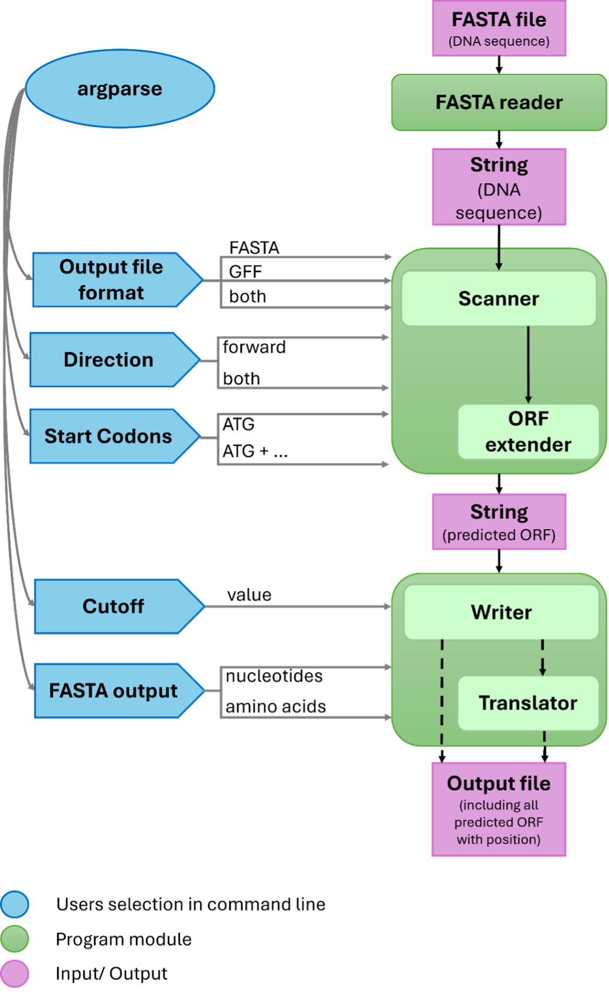
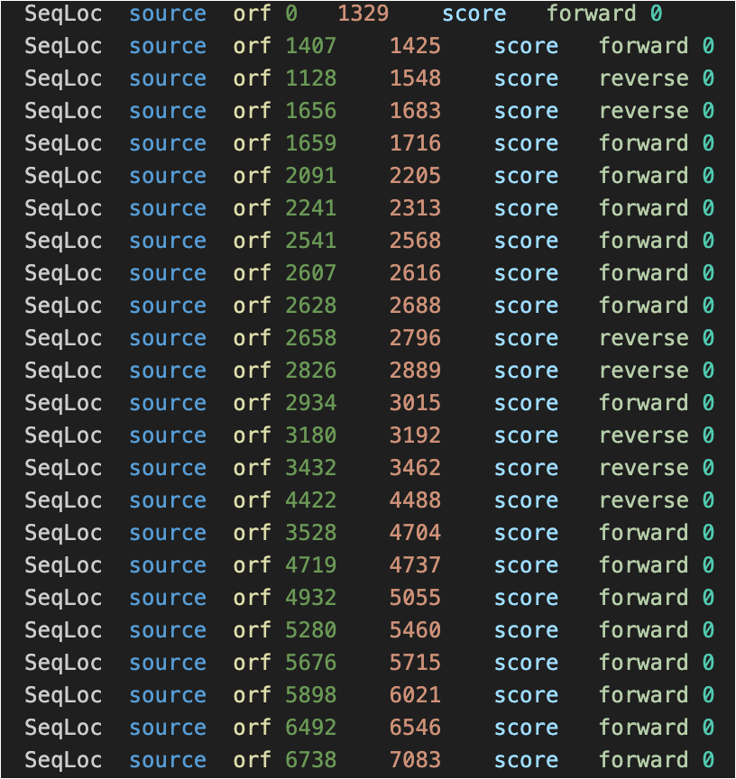
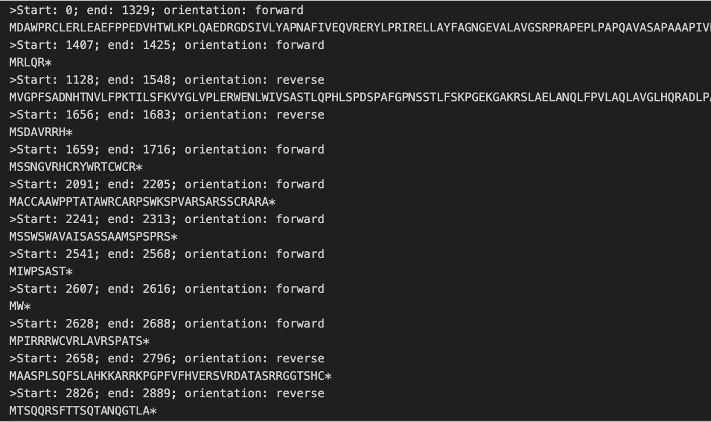
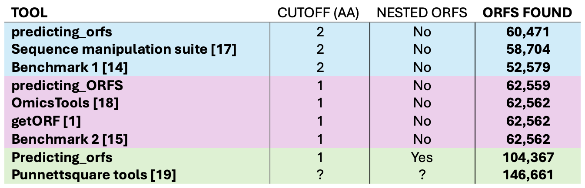
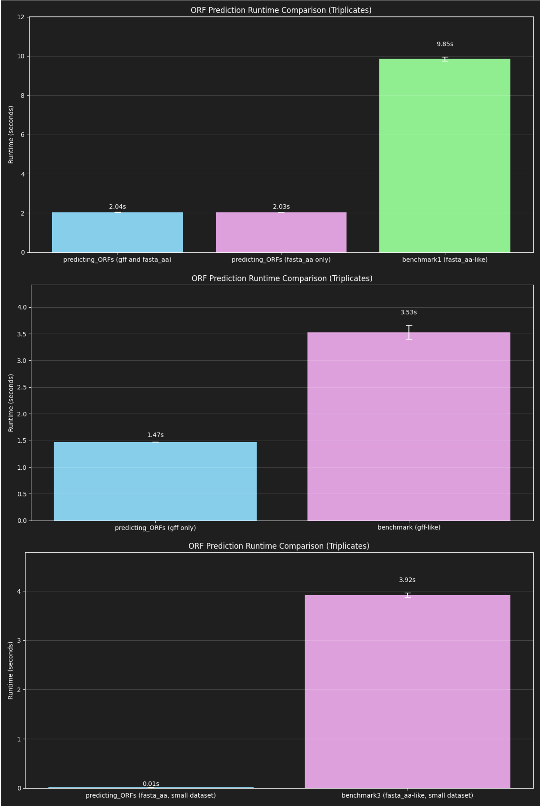
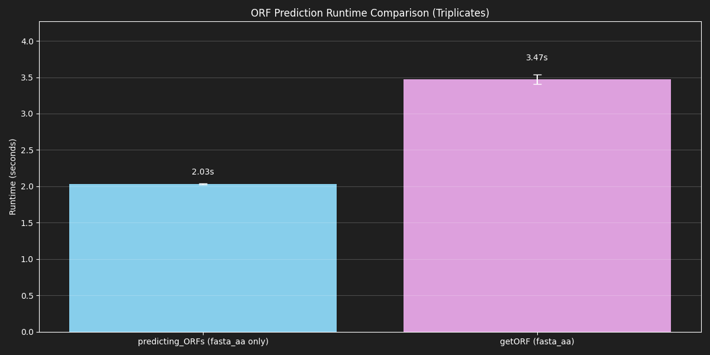

# PORF

A fast and customizable Python rule-based Open Reading Frame (ORF) detection tool for nucleotide sequences in FASTA format.

The program scans DNA sequences for potential protein-coding regions by identifying start codons and in-frame stop codons. It supports scanning of multiple reading frames, optional reverse strand analysis, and outputs results in FASTA and/or GFF format.

This tool is designed to be lightweight, computationally efficient, and easily integrated into bioinformatics workflows.

## Table of Contents

- [Features](#features)
- [Requirements](#requirements)
- [Installation](#installation)
- [Structure](#structure)
- [Configuration](#configuration)
- [Usage](#usage)
  - [Output Format](#output-format)
  - [FASTA Output Type](#fasta-output-type)
  - [Strand Direction](#strand-direction)
  - [Minimum ORF Length](#minimum-orf-length)
  - [Start Codon Selection](#start-codon-selection)
- [Input](#input)
- [Output](#output)
  - [GFF Output](#gff-output)
  - [FASTA Output](#fasta-output)
- [Validation and Benchmarking](#validation-and-benchmarking)
- [Authors](#authors)
- [License](#license)

## Features

- Detects Open Reading Frames (ORFs) in nucleotide sequences
- Scans three reading frames
- Optional forward-only or forward + reverse strand scanning
- Supports alternative start codons
- Adjustable minimum ORF length cutoff
- Output in FASTA format (nucleotide or amino acid)
- Output in GFF annotation format
- Efficient processing of large genomic datasets
- Command-line interface for easy workflow integration

## Requirements

- Python 3.8 or higher
- No external Python dependencies required (standard library only)

## Installation

Clone the repository:

git clone https://github.com/N-ik-o/biocomputing.git \
cd biocomputing

No additional installation is required.

## Structure

### Pseudocode structure



### File structure
```
biocomputing/
├── input_files/          # Directory containing input datasets 
├── output_files/         # Directory containing generated results
├── readme_figures/       
├── constants.py          # Configuration variables and constants
├── predicting_ORFs.py    # Main script
└── README.md             
```
## Configuration

The codon translation tables are defined in constants.py:
- CODON_2_AA_FW → forward strand codon to amino acid mapping
- CODON_2_AA_RV → reverse strand codon to amino acid mapping

Important: If your organism uses alternate genetic codes or non-standard start codons, you must update these dictionaries accordingly before running the program.

## Usage

Run the script from the command line:

python predicting_orfs.py [options] output_name input_file

Example:

python predicting_orfs.py -f both -fo aa -d both -c 50 test input_files/Xc_genome_full_5.18mb.fa

This command will:
- scan both strands
- output FASTA and GFF files
- translate ORFs to amino acid sequences
- require a minimum ORF length of 50 amino acids

### Output Format

`-f`, `--format`

Choose the output format.

| Option | Description |
|------|------|
| gff (default) | Write results in GFF annotation format |
| fasta | Write ORFs to a FASTA file |
| both | Generate both FASTA and GFF outputs |

### FASTA Output Type

`-fo`, `--fasta_output`

Defines the type of sequence written when FASTA output is selected.

| Option | Description |
|------|------|
| nuc (default) | Output nucleotide sequences |
| aa | Translate ORFs and output amino acid sequences |

### Strand Direction

`-d`, `--direction`

Defines which DNA strands are scanned.

| Option | Description |
|------|------|
| fw (default) | Scan forward strand only |
| both | Scan both forward and reverse strands |

### Minimum ORF Length

`-c`, `--cutoff`

Sets the minimum ORF length in amino acids.

### Start Codon Selection

`-s`, `--start_codons`

Defines which start codons are accepted when initiating an ORF.

| Option | Start codons |
|------|------|
| ATG | Canonical start codon only |
| +GTG | ATG and GTG |
| +TTG | ATG and TTG |
| +GTG+TTG | ATG, GTG, and TTG |

Note: Alternative start codons are often translated as methionine.


## Input

The program requires a DNA sequence in FASTA format.

Standard FASTA format:

>sequence_name
ATGCGTACGTTAGCGT...

Requirements:
- Sequences must contain standard nucleotide characters (A, T, G, C).
- Input files may contain one or multiple sequences.

Note:
Ambiguous nucleotide symbols (e.g., N, R, Y) are currently not supported.

## Output

Depending on the selected options, the program produces either **GFF**, **FASTA**, or both output formats.

### GFF Output

The GFF output contains annotation-style information about detected ORFs.

Fields include:
- Sequence ID
- Feature type (CDS)
- Start position
- End position
- Strand
- Frame
- ORF identifier
- ORF length

#### Example:



### FASTA Output

FASTA output contains the sequences of predicted ORFs.

Header information includes:
- ORF ID
- Source sequence
- Start and end position
- Strand direction

#### Example:



## Validation and Benchmarking

The tool was validated and benchmarked via comparison to other tools. 

### Accuracy



### Computation speed

#### Rule-based python tools from GitHub



#### Rule-based C tool



## Authors

- Marie Sonntag (maso01-tuple)
- Niko Stanke (N-ik-o; niko-stanke@proton.me)

## License

This repository is licensed under the terms of the [LICENSE](LICENSE) file.
